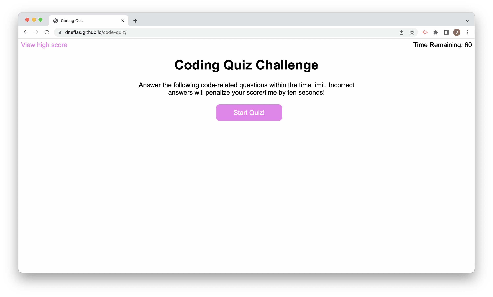

# Code Quiz

## Description
Code Quiz is a timed quiz application that stores high scores using client-side storage. The application features dynamically updated HTML and CSS using Javascript. New concepts expored in this code are the document object, the window object, DOM API methods, and event driven functions.

## Built With
* HTML
* CSS
* Javascript

## Deployed Application

https://dneflas.github.io/code-quiz/
